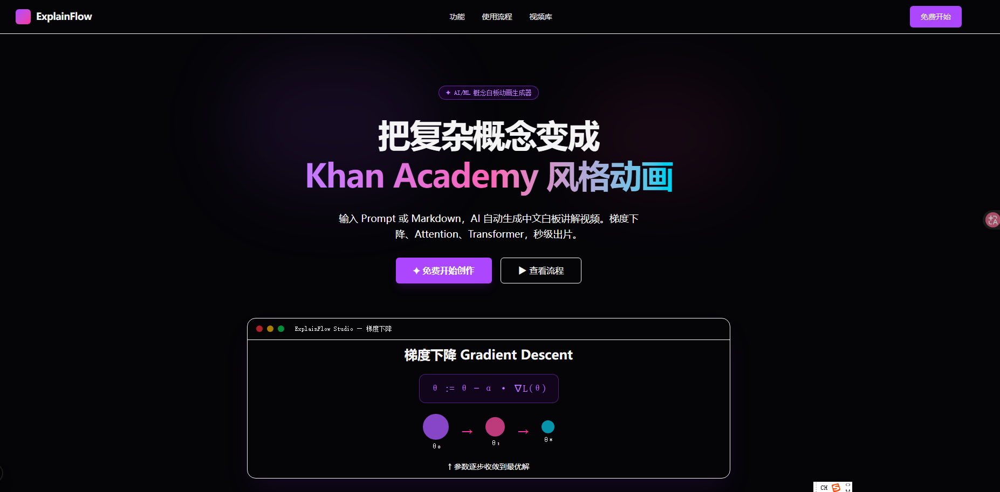
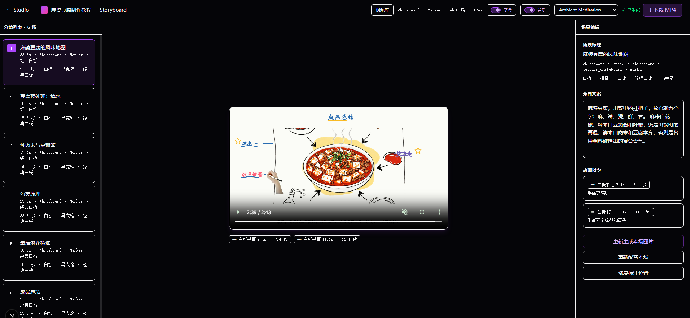

# ExplainFlow

ExplainFlow 是一个本地化教学视频生成工具。目标是把用户输入的主题、讲解要求或参考图，生成带旁白、板书节奏、手写/标注过程和最终 MP4 输出的白板讲解视频。






## 当前状态

- MVP 主链路已打通：主题输入 -> 讲解规划 -> Storyboard -> TTS -> Remotion 代码生成 -> MP4 渲染。
- 生成策略已经从“针对单一题材打补丁”改为通用课堂表达：按教学关系、信息密度、画面复杂度和讲画同步要求决定呈现方式。
- 普通白板讲解不再默认生成参考位图，避免图形和文字背后出现像纸片一样的底板、阴影或卡片面。
- 通用题材不再特殊考虑 MOS/FinFET，统一走“全局地图、结构拆解、优先取舍、目标路径、反馈闭环”等通用解释框架。
- 文案和图形提示已强化为更生动的课堂表达，避免只有单调勾选、空泛标题或枯燥列表。
- 2026-05-22 完成一次端到端冒烟生成和清理：视频可生成、TTS 和音视频流正常；临时 MP4、抽帧、生成目录和后台日志已清理。

## 项目结构

```text
apps/
  render/      Remotion 渲染服务，负责 TTS、代码校验、bundle 和 MP4 输出
  web/         Next.js 前端
services/
  api/         FastAPI 服务，负责规划、故事板、旁白和任务编排
evals/         评测脚本与评分说明
outputs/       本地视频输出目录，默认不入库
```

## 模型接入与环境变量

项目从 `.env` 或进程环境读取配置。不要把真实 key 写入文档或提交到仓库。

ExplainFlow 需要接入两类大模型能力，语音合成本地完成：

- 文本规划、Storyboard 和 Remotion 代码生成：使用 OpenAI-compatible Chat API。默认示例是 DeepSeek，`LLM_MODEL` 用于讲解规划，`CODER_MODEL` 用于 Remotion 代码生成。
- 图像生成：使用火山引擎 Ark / Seedream，用于参考图或场景图生成。完整体验建议配置 `ARK_API_KEY`；只跑纯白板矢量链路时可以先不配。
- 语音合成：使用 `edge-tts`，只需要配置 `TTS_VOICE`，不需要额外 API key。

首次启动先复制示例配置：

```powershell
Copy-Item services/api/.env.example services/api/.env
Copy-Item apps/render/.env.example apps/render/.env
Copy-Item apps/web/.env.local.example apps/web/.env.local
```

macOS / Linux 可使用：

```bash
cp services/api/.env.example services/api/.env
cp apps/render/.env.example apps/render/.env
cp apps/web/.env.local.example apps/web/.env.local
```

### `services/api/.env`

后端负责大模型调用、规划、分镜和旁白。默认配置如下，换供应商时只要保证接口兼容 OpenAI Chat API，并同步修改 `OPENAI_BASE_URL`、`LLM_MODEL` 和 `CODER_MODEL`：

```env
OPENAI_API_KEY=your-deepseek-or-openai-compatible-key
OPENAI_BASE_URL=https://api.deepseek.com/v1
LLM_MODEL=deepseek-chat
CODER_MODEL=deepseek-coder

ARK_API_KEY=your-volcengine-ark-key
ARK_BASE_URL=https://ark.cn-beijing.volces.com/api/v3
SEEDREAM_MODEL=doubao-seedream-5-0-260128

TTS_VOICE=zh-CN-XiaoxiaoNeural
CORS_ALLOWED_ORIGINS=http://localhost:3000,http://127.0.0.1:3000
API_HOST=0.0.0.0
API_PORT=8000
LOG_LEVEL=INFO
```

注意图像生成变量名以当前代码为准：使用 `ARK_BASE_URL` 和 `SEEDREAM_MODEL`。

### `apps/web/.env.local`

前端只需要知道 API 服务和渲染服务地址：

```env
NEXT_PUBLIC_API_URL=http://localhost:8000
NEXT_PUBLIC_RENDER_URL=http://localhost:3001
```

### `apps/render/.env`

渲染服务负责 TTS、Remotion bundle、MP4 渲染和下载。Chrome / Chromium / Edge、ffmpeg 和字体路径会自动探测，通常不用手写本机绝对路径：

```env
RENDER_PORT=3001
PYTHON_API_URL=http://localhost:8000

# 通常留空，服务会自动探测 Playwright / Chrome / Chromium / Edge。
# REMOTION_BROWSER_EXECUTABLE=/absolute/path/to/chrome-or-chromium
# REMOTION_CHROME_HEADLESS_SHELL=/absolute/path/to/chrome-headless-shell

# 相对路径会按仓库根目录解析，避免写死 C:/Users/... 这类本机路径。
# EXPLAINFLOW_OUTPUT_DIR=outputs
# EXPLAINFLOW_MUSIC_DIR=outputs/music
# EXPLAINFLOW_RENDER_GENERATED_DIR=apps/render/generated

# ffmpeg / ffprobe 已在 PATH 时不用配置。
# FFMPEG_PATH=/absolute/path/to/ffmpeg
# FFPROBE_PATH=/absolute/path/to/ffprobe
```

## 本地启动

启动 API：

```powershell
cd services/api
uv run uvicorn main:app --host 127.0.0.1 --port 8000
```

启动渲染服务：

```powershell
cd apps/render
node server.mjs
```

启动前端：

```powershell
cd apps/web
npm run dev
```

## 验证命令

```powershell
python -m compileall services/api/main.py services/api/src
node --check apps/render/server.mjs
```

## 最近进展

2026-05-22 完成渲染链路冒烟和清理：

- 用 `What is Machine Learning` 跑通 Graph -> Storyboard -> Remotion code -> Render -> QA -> Download。
- 修复 `gen_test.py` 进度显示单位，避免把 `0-100` 百分数再次按百分比格式化成 `10000%`。
- 修复渲染 QA 的时长判断，改为使用最终 Remotion composition 期望时长。
- 修复渲染服务下载路径缺少 `createReadStream` 导入的问题。
- 修复 planner timing 模块缺少 `_trim_text_to_chars` 导入的问题。
- 增加 required labels 旁白兜底，让关键画面标签进入 TTS 文案。
- 清理本轮临时 MP4、抽帧图片、后台日志、生成目录、`outputs` 评测产物、`evidence` 参考帧、旧中文说明文件和 Python 缓存。
- 删除不再保留的 `docs/` 与 `discuss/` 文档目录。

2026-05-19 完成了一轮白板质量修复：

- 移除了普通白板图形背后的纸片感底影。
- 禁止生成代码使用阴影、滤镜、渐变和内层纸面。
- 通用问题解决框架改为确定性 5 场景。
- 把裸露勾选符号改成有标签的轻松提示，例如“有谱”“别慌”“下一步”。
- 清理 `.tmp` 临时日志、e2e 中间产物和抽帧图片，并将 `.tmp/` 加入忽略列表。
